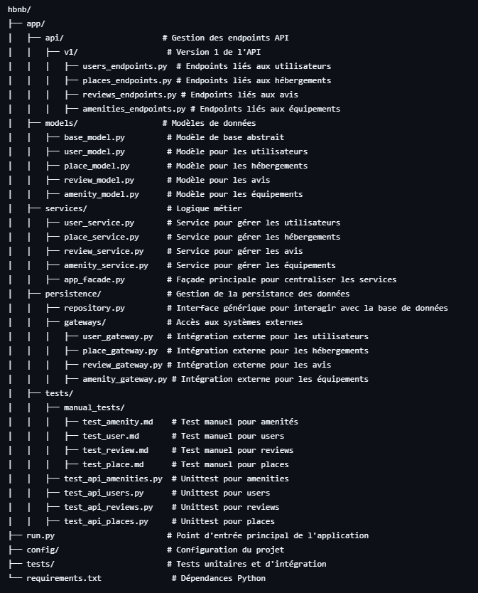
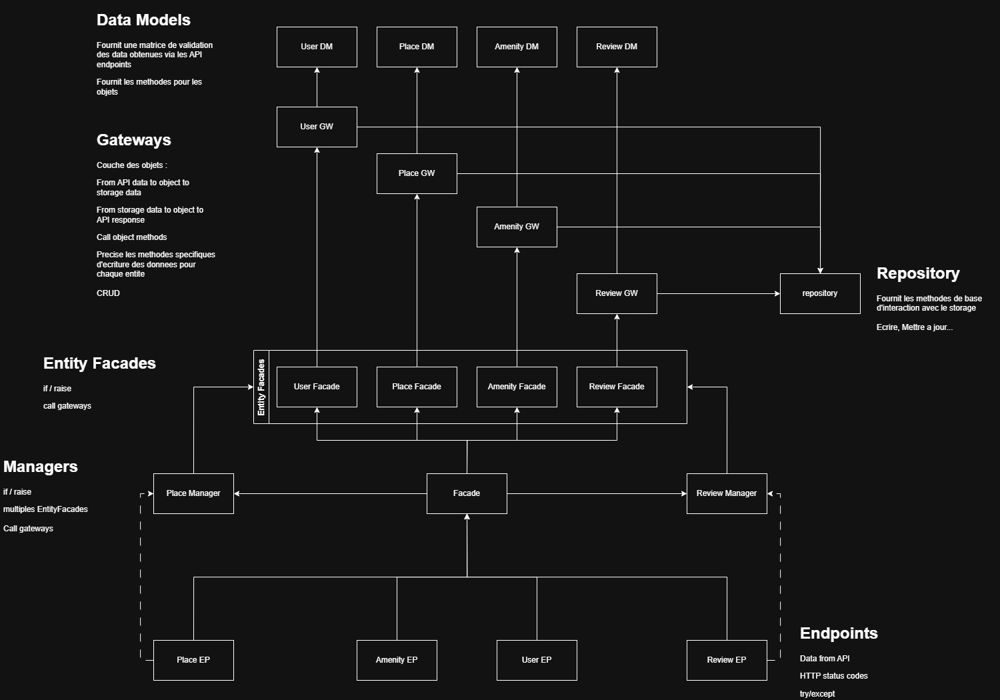

## Structure generale du projet

##  Explication des Composants Clés

### 1 API (app/api/)

- Utilise Flask-RESTx pour gérer les routes de l'API REST.
- Les différentes versions sont contenues dans des sous-dossiers (v1/).
- Chaque entité importante (utilisateurs, places, avis, équipements) a ses propres endpoints.

### 2 Modèles (app/models/)

- Définissent la structure des données et les interactions avec la base de données.
- base_model.py sert de classe parent pour factoriser les comportements communs.
- Chaque entité (User, Place, Review, etc.) a son propre modèle.

### 3 Services (app/services/)

- Contient la logique métier de l'application.
- Sépare la gestion des données de la couche API pour plus de flexibilité.
- app_facade.py sert de point central pour orchestrer les services.

### 4 Persistence & Gateways (app/persistence/)

- repository.py est une interface générique pour interagir avec la base de données.
- Le dossier gateways/ permet d'intégrer des services externes (ex : API de paiement, services de localisation).

### 5 Configuration (config/)

- Centralise les paramètres selon l'environnement : développement, test, production.
- Permet une adaptation facile sans modifier directement le code source.

### 6 Tests (tests/)

- Contient des tests unitaires pour chaque service et modèle.
- Permet d'assurer la robustesse du code avant chaque mise en production.

🛑 **Attention** : 

La fonction utiliser pour vérifier la validité d'une adresse e-mail vérifie également l'existance du nom de domaine
(une adresse comme xxxx@example.com ne fonctionnera pas utiliser plutôt une adresse comme xxxx@gmail.com)
