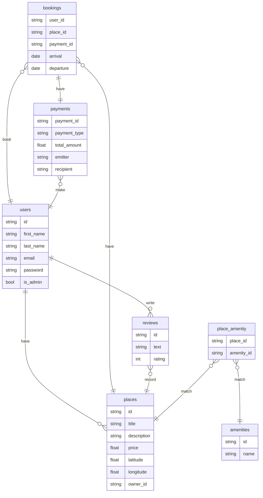

```mermaid
erDiagram
    users {
        string id
        string first_name
        string last_name
        string email
        string password
        bool is_admin
    }

    places {
        string id
        string title
        string description
        float price
        float latitude
        float longitude
        string owner_id
    }

    reviews {
        string id
        string text
        int rating
    }

    amenities {
        string id
        string name
    }

    place_amenity {
        string place_id
        string amenity_id
    }

    bookings {
        string user_id
        string place_id
        string payment_id
        date arrival
        date departure
    }

    payments {
        string payment_id
        string payment_type
        float total_amount
        string emitter
        string recipient
    }
    
    users ||--o{ places : have
    bookings }o--|| users : book
    bookings }o--|| places : have
    bookings ||--|| payments : have
    payments }o--|| users : make
    users ||--o{ reviews : write
    reviews }o--|| places : record
    place_amenity }o--|| places : match
    place_amenity }o--|| amenities : match
```
  